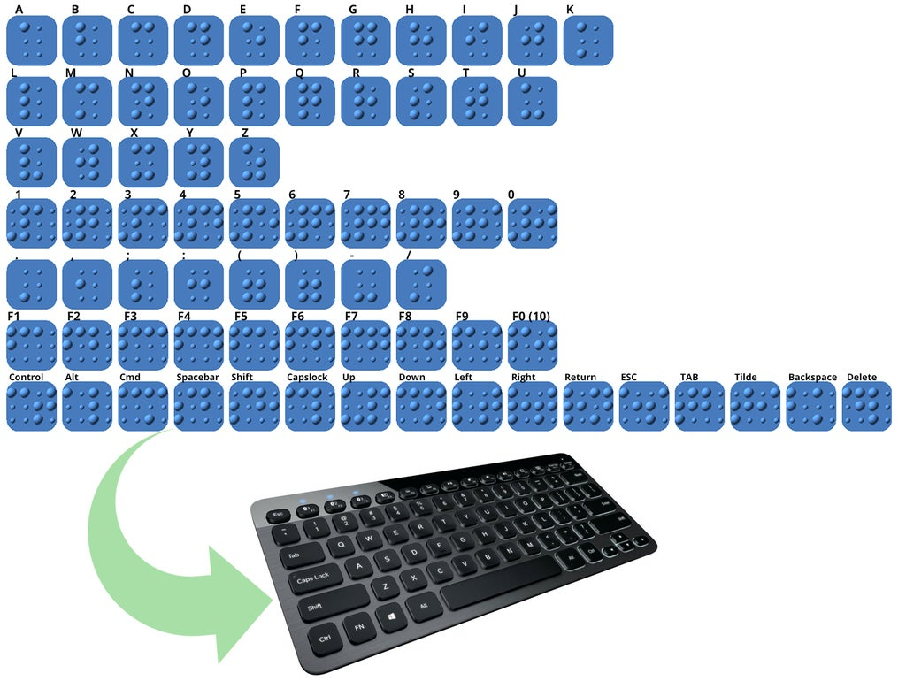

# Braille Keyboard Covers
I moved these over to github from thingiverse.

## Instructions

https://openscad.org/downloads.html

For best results open in OpenSCAD, instructions - https://youtu.be/cukWgTyvWNs

`scad/braille_keyboard_covers.scad`

Tweak the settings yourself. Based on braille worldwide medical standards http://www.pharmabraille.com/

Default size is at minimum key size, you will likely want to increase this.

• Use "Text Drop Down Box Select sets" to create stls of specific character sets `[all,alphabetic,numeric,symbols,functions,commands,swedish]` due to the complicated operations thingiverse might have problems rendering the whole set at once.

• The main settings to modify are Base Height, Key Size & Braille Scale.

• If you want to customise this more, all the braille settings regarding spacing and dot height are accessible if you download the scad file and open it directly in OpenSCAD

`stl/braille_keyboard_covers.stl`

default settings, $fn=20
All keys. Warning these are at the minimum possible size. Use OpenSCAD to increase to the size of your keyboard keys in mm.

## How to Video

